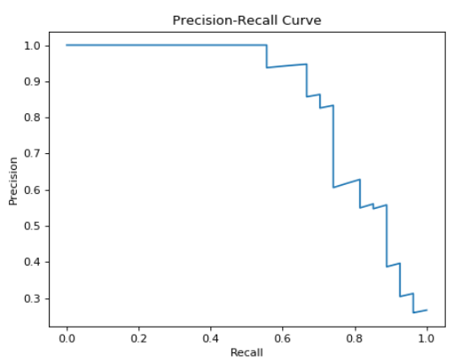

# Module 3 Quiz

1. A supervised learning model has been built to predict whether someone is infected with a new strain of a virus. The probability of any one person having the virus is 5%. Using accuracy as a metric, what would be a good choice for a baseline accuracy score that the new model would want to outperform?

**Solução:**

Para determinar uma boa pontuação de precisão de referência (baseline accuracy) para o novo modelo, precisamos considerar a probabilidade da classe majoritária no conjunto de dados, que é a classe que representa pessoas não infectadas com a nova cepa do vírus.

- Identificar a probabilidade da classe majoritária (pessoas não infectadas): Neste caso, a probabilidade de alguém não ter o vírus é $100\% - 5\% = 95\%$.
- Usar a probabilidade da classe majoritária como a precisão de referência (baseline accuracy): Uma vez que a classe majoritária representa o resultado mais comum (não infectado), um modelo de referência simples que sempre prevê a classe majoritária alcançaria uma precisão de $95\%$.
- O novo modelo deve ter como objetivo superar essa pontuação de precisão de referência: O objetivo do novo modelo é ter uma precisão maior que 95% para ser considerado melhor que a referência.

Portanto, uma boa escolha para a precisão de referência (baseline accuracy) que o novo modelo desejaria superar é $95\%$.

Conhecimento relacionado:

- Entendimento do conceito de precisão de referência (baseline accuracy) em tarefas de classificação binária.
- Avaliação do desempenho do modelo usando a precisão como métrica.
- Importância de estabelecer benchmarks de desempenho para comparar a eficácia dos modelos.

2. Given the following confusion matrix:

<center>

| |Predicted Positive| Predicted Negative |
|---:|:--:|:--:|
Condition positive |  67| 11|
Condition negative | 3 | 8|

</center>

Compute the accuracy o three decimals places.

**Solution**

Vamos calcular o valor do _accuracy_

- Verdadeiros positivos (True Positives, TP): 67 (casos positivos corretamente previstos)
- Verdadeiros negativos (True Negatives, TN): 8 (casos negativos corretamente previstos)
- Falsos positivos (False Positives, FP): 11 (casos negativos erroneamente previstos como positivos)
- Falsos negativos (False Negatives, FN): 3 (casos positivos erroneamente previstos como negativos)

Calcule a precisão (accuracy):
A precisão é a proporção de previsões corretas em relação ao total de previsões.

$$
\begin{align*}
Precisão (Accuracy) &= \frac{(TP + TN)} {(TP + TN + FP + FN)} \\
Precisão (Accuracy) &= \frac{(67 + 8)}{(67 + 8 + 11 + 3)} \\
Precisão (Accuracy) &= \frac{75}{89} \\
Precisão (Accuracy) &≈ 0.842 \\
\end{align*}
$$

Portanto, a precisão (accuracy) é aproximadamente $0.842$, arredondado para três casas decimais.

Conhecimento relacionado:

- Matriz de Confusão: Entendimento da matriz usada para avaliar o desempenho de modelos de classificação.
- Métricas de Avaliação: Precisão (Accuracy) é uma das métricas usadas para medir o desempenho de um modelo de classificação.
- Fórmulas para calcular as métricas de avaliação em relação aos valores da matriz de confusão.


3. Given the following confusion matrix:

<center>

| |Predicted Positive| Predicted Negative |
|-----------------:|:---:|:--:|
Condition Positive | 102 | 56 |
Condition Negative | 17  | 78 |

</center>

Compute the precision to three decimal places.

**Solução**

Vamos calcular a _precision_

- Verdadeiros positivos (True Positives, TP): 102 (casos positivos corretamente previstos)
- Falsos positivos (False Positives, FP): 56 (casos negativos erroneamente previstos como positivos)
- Verdadeiros negativos (True Negatives, TN): 78 (casos negativos corretamente previstos)
- Falsos negativos (False Negatives, FN): 17 (casos positivos erroneamente previstos como negativos)

A precisão é a proporção de verdadeiros positivos em relação ao total de casos positivos previstos.

$$
\begin{align*}
Precisão (Precision) &= \frac{TP}{(TP + FP)} \\
Precisão (Precision) &= \frac{102}{(102 + 17)} \\
Precisão (Precision) &= \frac{102}{119} \\
Precisão (Precision) &≈ 0.857 \\
\end{align*}
$$

Portanto, a precisão (precision) é aproximadamente $0.646$, arredondada para três casas decimais.

Conhecimento relacionado:

- Matriz de Confusão: Entendimento da matriz usada para avaliar o desempenho de modelos de classificação.
- Métricas de Avaliação: Precisão (Precision) é uma das métricas usadas para medir o desempenho de um modelo de classificação.
- Fórmulas para calcular as métricas de avaliação em relação aos valores da matriz de confusão.


4. Given the following confusion matrix:

<center>

| |Predicted Positive| Predicted Negative |
|-----------------:|:---:|:--:|
Condition Positive | 102 | 56 |
Condition Negative | 17  | 78 |

</center>

Compute the recall to three decimal places.

**Solução**

Vamos calcular o _recall_

- Verdadeiros positivos (True Positives, TP): 102 (casos positivos corretamente previstos)
- Falsos negativos (False Negatives, FN): 56 (casos positivos erroneamente previstos como negativos)
- Verdadeiros negativos (True Negatives, TN): 78 (casos negativos corretamente previstos)
- Falsos positivos (False Positives, FP): 17 (casos negativos erroneamente previstos como positivos)

O recall é a proporção de verdadeiros positivos em relação ao total de casos positivos reais.

$$
\begin{align*}
Recall &= \frac{TP}{(TP + FN)} \\
Recall &= \frac{102}{(102 + 56)} \\
Recall &= \frac{102}{158} \\
Recall &≈ 0.646 \\
\end{align*}
$$

Portanto, o recall é aproximadamente 0.646, arredondado para três casas decimais.

Conhecimento relacionado:

Matriz de Confusão: Entendimento da matriz usada para avaliar o desempenho de modelos de classificação.
Métricas de Avaliação: Recall é uma das métricas usadas para medir o desempenho de um modelo de classificação.
Fórmulas para calcular as métricas de avaliação em relação aos valores da matriz de confusão.


5. Using the fitted model `m` create a precision-recall curve to answer the following question:

    For the fitted model `m`, approximately what precision can we expect for a recall of 0.8?

(Use y_test and X_test to compute the precision-recall curve. If you wish to view a plot you can use `plt.show()`)

**Solução**

Para criar uma curva de precisão-recall para o modelo ajustado `m`` e estimar a precisão para um recall de 0.8, amos seguir os seguintes passos:

- Importe as bibliotecas necessárias:
Você precisará das bibliotecas numpy, matplotlib e da função precision_recall_curve da biblioteca sklearn.metrics.

- Obtenha as previsões do modelo m para o conjunto de teste (X_test):
Use o modelo ajustado m para fazer previsões nos dados de teste (X_test) e armazene as previsões.

- Calcule a curva de precisão-recall:
Use a função precision_recall_curve para calcular a precisão e o recall para diferentes limiares de probabilidade do modelo. Isso cria um conjunto de valores de precisão e recall que podem ser usados para plotar a curva.

- Encontre a precisão para um recall de 0.8:
Depois de calcular a curva de precisão-recall, encontre o valor de precisão correspondente a um recall de 0.8. Isso pode ser feito procurando o valor mais próximo de 0.8 no array de recalls e obtendo o valor correspondente no array de precisões.

- Plote a curva de precisão-recall (opcional):
Se desejar, você pode usar a biblioteca matplotlib para plotar a curva de precisão-recall e visualizar a relação entre precisão e recall.

Conhecimento relacionado:

- Avaliação de modelos de classificação: A curva de precisão-recall é uma ferramenta importante para avaliar o desempenho de modelos de classificação, especialmente quando as classes estão desbalanceadas.
- Precision-Recall Curve: Compreender como a curva é criada e interpretada pode fornecer insights sobre a precisão e o recall em diferentes pontos de corte das probabilidades do modelo.
- Uso da biblioteca Scikit-learn: A biblioteca Scikit-learn é amplamente utilizada para a construção e avaliação de modelos de aprendizado de máquina, incluindo a criação de curvas de precisão-recall.

```python
print(m)
```

```
LogisticRegression(C=1.0, class_weight=None, dual=False, fit_intercept=True, intercept_scaling=1, max_iter=100, multi_class='ovr', n_jobs=1, penalty='12', random_state=None, solver = 'liblinear', tol=0.0001, verbose=0, warm_start=False)
```

```
# Previsões do modelo m para o conjunto de teste
y_pred_probs = m.predict_proba(X_test)[:, 1]

# Calculando a curva de precisão-recall
precision, recall, thresholds = precision_recall_curve(y_test, y_pred_probs)

# Encontrando a precisão para um recall de 0.8
idx = np.argmax(recall >= 0.8)
precision_at_recall_08 = precision[idx]

print("Precision at recall 0.8:", precision_at_recall_08)
```
```
Precision at recall 0.8: 0.267326732673
```

```python
# Plote a curva de precisão-recall (opcional)
plt.plot(recall, precision)
plt.xlabel('Recall')
plt.ylabel('Precision')
plt.title('Precision-Recall Curve')
plt.show()
```
<center>



</center>

8. Using the fitted model `m` what is micro precision score?

(Use y_test and X_test to compute the precision score.)

```python
print(m)
```
```
SVC(C=1.0, cache_size=200, class_weight=None, coef0=0, decision_function_shape=None, degree = 3, gamma = 'auto', kernel = 'rbf', max_iter=-1, probability=False, random_state=None, shrinking=True, tol=0.001, verbose=False)
```

**Solução**

Para calcular o micro precision score usando o modelo ajustado `m``, Vamos precisar seguir os seguintes passos:

- Importe a função precision_score da biblioteca sklearn.metrics.
- Faça as previsões do modelo m para o conjunto de teste (X_test).
- Calcule o micro precision score usando a função precision_score.

```python
from sklearn.metrics import precision_score

# Faz as previsões do modelo m para o conjunto de teste
y_pred = m.predict(X_test)

# Calculo do micro precision score
micro_precision_score = precision_score(y_test, y_pred, average='micro')

print("Micro Precision Score:", micro_precision_score)
```

Neste código, a função `precision_score` é usada para calcular o micro precision score. O parâmetro `average='micro'` indica que queremos calcular o score considerando todas as classes como uma única classe (abordagem micro).

O micro precision score é útil quando há um desequilíbrio significativo entre as classes, e desejamos atribuir mais importância às previsões das classes majoritárias.

Conhecimento relacionado:

- Avaliação de modelos de classificação: A precisão é uma das métricas usadas para avaliar o desempenho de modelos de classificação.
- Micro Precision Score: Entendimento sobre a abordagem micro para calcular a precisão em casos de classes desequilibradas.
- Uso da biblioteca Scikit-learn: A biblioteca Scikit-learn é amplamente utilizada para a construção e avaliação de modelos de aprendizado de máquina, incluindo o cálculo de métricas de avaliação como a precisão.

9. Which of the following is tru of the R-Squared regression score metric?

    ✅ A model that always predicts the mean of y would get a score of 0.0

    ✅ The highest possible score is 1.0

    ✅ The score can sometimes be negative.

    ❎ A model that always predicts the mean of y would get a score of 0.5

**Solução**

O R-squared é uma métrica comum para avaliar o desempenho de modelos de regressão. Vamos analisar cada afirmação:

- A model that always predicts the mean of y would get a score of 0.0:
    
    Isso é verdadeiro. Quando um modelo sempre faz previsões iguais à média dos valores reais de y, o R-squared será igual a 0.0. Significa que o modelo não está fornecendo nenhuma explicação da variabilidade dos dados em relação à média.

- The highest possible score is 1.0:
    
    Isso também é verdadeiro. O R-squared varia de 0.0 a 1.0. Um valor de 1.0 indica que o modelo explica toda a variabilidade dos dados, ou seja, todas as variações em y podem ser perfeitamente previstas a partir das variáveis independentes do modelo.

- The score can sometimes be negative:

    Isso é verdadeiro. Embora o R-squared geralmente varie de 0.0 a 1.0, em casos de modelos de regressão com desempenho muito ruim, ele pode ser negativo. Isso pode acontecer quando o modelo é pior do que simplesmente usar a média dos valores de y como previsão.

- A model that always predicts the mean of y would get a score of 0.5:
    
    Isso é falso. Como mencionado na primeira afirmação, um modelo que sempre prevê a média de y terá um R-squared de 0.0, não de 0.5.

Conhecimento relacionado:

- Coeficiente de determinação (R-squared): Entendimento sobre o R-squared como uma métrica comum para medir o desempenho de modelos de regressão.
- Interpretação do R-squared: Compreender o significado dos valores do R-squared em relação à qualidade do ajuste do modelo aos dados.

10. In a future society, a video surveillance algorithm is used to predict  a crime before it occurs. If you were reponsible for tuning this machine, what evaluation metric would you want to maximize to ensure no innocent people (people not about to commit a crime) are imprisoned (where crime is positive label)?

- Accuracy
- Precision
- Recall
- F1
- AUC

**Solução**

Se o objetivo é garantir que todos os criminosos (pessoas prestes a cometer um crime) sejam presos, a métrica de avaliação mais relevante a ser maximizada é a "Precision" (Precisão Positiva).

O objetivo é minimizar o número de falsos positivos (pessoas não prestes a cometer um crime, mas identificadas como criminosos pelo algoritmo) para garantir que todos os criminosos sejam presos com precisão.

A Precision é a proporção de casos positivos corretamente previstos em relação ao número total de previsões positivas do modelo. No contexto desse algoritmo de vigilância, a precisão mede a capacidade do modelo de fazer previsões corretas sobre quem está prestes a cometer um crime, ou seja, identificar corretamente os criminosos.

Neste cenário, um falso positivo representaria uma pessoa que não está prestes a cometer um crime, mas foi erroneamente identificada pelo algoritmo como criminosa. Isso pode levar à prisão injusta de pessoas inocentes. Portanto, é essencial minimizar os falsos positivos, o que significa maximizar a Precision.

Outras métricas como a "Recall", "F1 Score" ou "AUC" podem ser úteis para avaliar o desempenho geral do modelo, mas se o objetivo principal é garantir que todos os criminosos sejam presos com precisão, a Precision é a métrica mais relevante e deve ser maximizada.

Conhecimento relacionado:

- Avaliação de modelos de classificação: Compreensão das diferentes métricas de avaliação utilizadas para medir o desempenho de modelos de classificação, como Accuracy, Precision, Recall, F1 Score e AUC.
- Precision e Recall: Compreender as diferenças e importância dessas métricas em cenários específicos, especialmente quando as consequências dos falsos positivos e falsos negativos são diferentes.

11. Consider the algorithm from the previous question. If you were responsible for tuning this machine, what evaluation metric would you wnat to maximize to ensure all criminals (people about to commit a crime) are impresoned (where crime is the positive label)?

- Accuracy
- Precision
- Recall
- F1
- AUC

**Solução**

Se o objetivo é garantir que nenhuma pessoa inocente (que não está prestes a cometer um crime) seja presa, a métrica de avaliação mais relevante a ser maximizada é a "Recall" (Sensibilidade ou Taxa de Verdadeiros Positivos).

O objetivo é minimizar o número de falsos negativos (pessoas prestes a cometer um crime, mas não identificadas pelo algoritmo) para garantir que nenhum inocente seja preso erroneamente.

O Recall é a proporção de casos positivos corretamente identificados em relação ao número total de casos positivos reais. No contexto desse algoritmo de vigilância, o recall mede a capacidade do modelo de detectar com precisão os casos de crimes antes que ocorram, ou seja, identificar com sucesso as pessoas que estão prestes a cometer um crime.

Neste cenário, um falso negativo representaria uma pessoa prestes a cometer um crime que não foi detectada pelo algoritmo de vigilância. Isso pode levar a consequências graves, pois um criminoso pode escapar da vigilância e cometer um crime real. Portanto, é essencial minimizar os falsos negativos, o que significa maximizar o Recall.

Outras métricas como a "Precision", "F1 Score" ou "AUC" podem ser úteis para avaliar o desempenho geral do modelo, mas se o objetivo principal é garantir que nenhuma pessoa inocente seja presa erroneamente, o Recall é a métrica mais relevante e deve ser maximizado.

Conhecimento relacionado:

- Avaliação de modelos de classificação: Compreensão das diferentes métricas de avaliação utilizadas para medir o desempenho de modelos de classificação, como Accuracy, Precision, Recall, F1 Score e AUC.
- Precision e Recall: Compreender as diferenças e importância dessas métricas em cenários específicos, especialmente quando as consequências dos falsos positivos e falsos negativos são diferentes.

12. A classifier is trained on imbalanced multiclass dataset, where there is one 'frequent' majority class that represents 80% of the labeled data, and ten rare classes that together represent the remaining 20% of 'infrequent' labels. After looking at the model's precision scores, you find that the micro-averaged precision is  much larger than the macro-averaged precision score. Which of the following is most likely happening?

     * The model is probably misclassifying the frequent labels more than the infrequent labels.

    * The model is probably misclassifying the infrequent labels more than the frequent labels.

**Solução**

Para determinar o que está acontecendo com as métricas de precisão micro e macro no cenário de um classificador treinado em um conjunto de dados multiclasse desequilibrado, precisamos entender os seguintes passos:

- Micro-averaged precision: Calcula a precisão global considerando todas as previsões e verdadeiros positivos em todas as classes. Nesse caso, todos os erros e acertos em todas as classes são tratados como uma única grande classe.

- Macro-averaged precision: Calcula a precisão média de todas as classes separadamente e, em seguida, tira a média dessas precisões. Cada classe tem o mesmo peso na média, independentemente do tamanho do grupo de dados.

Compare as métricas de precisão:

Se o micro-averaged precision é muito maior do que o macro-averaged precision, isso indica que o modelo está performando muito bem nas classes da maioria (frequent labels), mas está encontrando dificuldades em classificar corretamente as classes minoritárias (infrequent labels). O motivo é que a métrica micro-averaged dá muito mais peso às classes da maioria, já que essas classes têm mais exemplos e, portanto, um impacto maior na métrica geral.

Resposta correta:

The model is probably misclassifying the infrequent labels more than the frequent labels.

Conhecimento relacionado:

- Métricas de Avaliação para Problemas Multiclasse: Compreensão das métricas micro e macro-averaged precision, bem como outras métricas relevantes para avaliar o desempenho de classificadores em problemas com múltiplas classes e desequilibrados.
- Desafios de Conjuntos de Dados Desbalanceados: Entendimento dos desafios de treinar modelos em conjuntos de dados com classes desbalanceadas e estratégias para lidar com esse problema.

13. Using the already defined RBF SVC model `m`, run a grid search on the parameters C and gamma, for values [0.01, 0.1, 1, 10]. The grid search should find the model that best optimizes for recall. How much better is the recall of this model than the precision? (Computel recall - precision to 3 decimal places)

(Use y_test and X_test to compute precision and recall.)

```python
print(m)
```
```
SVC(C=1.0, cache_size=200, class_weight=None, coef0=0.0, decision_function_shape=None, degree=3, gamma='auto', kernel='rbf', max_iter=-1, probability=False, random_state=0, shrinking=True, tol=0.001, verbose=False)
```

**Solução**

Para executar uma busca em grade (grid search) nos parâmetros C e gamma para otimizar o modelo SVC (Support Vector Classifier) em relação à métrica de recall, precisamos:

- Importar as bibliotecas necessárias e a função `SVC` do scikit-learn.

- Definir os valores para os parâmetros C e gamma que serão testados na busca em grade.

- Criar um dicionário de parâmetros contendo todas as combinações de valores para C e gamma que serão avaliadas na busca em grade.

- Criar um objeto `GridSearchCV` com o modelo SVC, o dicionário de parâmetros e especificando a métrica de recall como a métrica a ser otimizada.

- Ajustar o modelo `GridSearchCV`` aos dados de treinamento (X_train, y_train).

- Obter os melhores parâmetros do modelo.

- Calcular a precisão e recall do modelo usando os melhores parâmetros encontrados com os dados de teste (X_test, y_test).

- Calcular a diferença entre o recall e a precisão.

```python
import numpy as np
from sklearn.model_selection import GridSearchCV
from sklearn.svm import SVC
from sklearn.metrics import precision_score, recall_score

# Definir os valores para os parâmetros C e gamma
param_grid = {'C': [0.01, 0.1, 1, 10], 'gamma': [0.01, 0.1, 1, 10]}

# Criar o modelo SVC
svc = SVC(kernel='rbf', random_state=0)

# Criar o objeto GridSearchCV
grid_search = GridSearchCV(svc, param_grid, scoring='recall')

# Ajustar o modelo GridSearchCV aos dados de treinamento
grid_search.fit(X_train, y_train)

# Obter os melhores parâmetros do modelo
best_params = grid_search.best_params_

# Calcular a precisão e recall com os melhores parâmetros usando os dados de teste
y_pred = grid_search.predict(X_test)
precision = precision_score(y_test, y_pred)
recall = recall_score(y_test, y_pred)

# Calcular a diferença entre recall e precisão
recall_minus_precision = recall - precision

print("Best parameters:", best_params)
print("Precision:", precision)
print("Recall:", recall)
print("Recall - Precision:", round(recall_minus_precision, 3))
```

Conhecimento relacionado:

- Grid Search: Compreender o conceito de busca em grade para encontrar os melhores hiperparâmetros de um modelo de aprendizado de máquina.
- Métricas de Avaliação: Compreender as métricas de precisão e recall como formas de avaliar o desempenho de modelos de classificação em conjuntos de dados desequilibrados.
- Support Vector Classifier (SVC): Familiarizar-se com o modelo SVC e seus parâmetros, como C e gamma, que podem ser ajustados para melhorar o desempenho do modelo.

14. Using the already defined RBF SVC model `m`, run a grid search on the parameters C and gamma, for values [0.01, 0.1, 1, 10]. The grid search should find the model that best optimizes for precision. How much better is the precision of this model than the recall? (Compute precision - recall to 3 decimal places)

(Use y_test and X_test to compute precision and recall.)

```python
print(m)
```
```
SVC(C=1.0, cache_size=200, class_weight=None, coef0=0.0, decision_function_shape=None, degree=3, gamma='auto', kernel='rbf', max_iter=-1, probability=False, random_state=0, shrinking=True, tol=0.001, verbose=False)
```

**Solução**

Para executar uma busca em grade (grid search) nos parâmetros C e gamma para otimizar o modelo SVC (Support Vector Classifier) em relação à métrica de precisão, siga estes passos:

Passo a passo para realizar a busca em grade:

Importar as bibliotecas necessárias e a função SVC do scikit-learn.

Definir os valores para os parâmetros C e gamma que serão testados na busca em grade.

Criar um dicionário de parâmetros contendo todas as combinações de valores para C e gamma que serão avaliadas na busca em grade.

Criar um objeto GridSearchCV com o modelo SVC, o dicionário de parâmetros e especificando a métrica de precisão como a métrica a ser otimizada.

Ajustar o modelo GridSearchCV aos dados de treinamento (X_train, y_train).

Obter os melhores parâmetros do modelo.

Calcular a precisão e recall do modelo usando os melhores parâmetros encontrados com os dados de teste (X_test, y_test).

Calcular a diferença entre a precisão e o recall.

```python
# Definir os valores para os parâmetros C e gamma
param_grid = {'C': [0.01, 0.1, 1, 10], 'gamma': [0.01, 0.1, 1, 10]}

# Criar o modelo SVC
svc = SVC(kernel='rbf', random_state=0)

# Criar o objeto GridSearchCV
grid_search = GridSearchCV(svc, param_grid, scoring='precision')

# Ajustar o modelo GridSearchCV aos dados de treinamento
grid_search.fit(X_train, y_train)

# Obter os melhores parâmetros do modelo
best_params = grid_search.best_params_

# Calcular a precisão e recall com os melhores parâmetros usando os dados de teste
y_pred = grid_search.predict(X_test)
precision = precision_score(y_test, y_pred)
recall = recall_score(y_test, y_pred)

# Calcular a diferença entre a precisão e o recall
precision_minus_recall = precision - recall

print("Best parameters:", best_params)
print("Precision:", precision)
print("Recall:", recall)
print("Precision - Recall:", round(precision_minus_recall, 3))
```

Conhecimento relacionado:

- Grid Search: Compreender o conceito de busca em grade para encontrar os melhores hiperparâmetros de um modelo de aprendizado de máquina.
- Métricas de Avaliação: Compreender as métricas de precisão e recall como formas de avaliar o desempenho de modelos de classificação em conjuntos de dados desequilibrados.
- Support Vector Classifier (SVC): Familiarizar-se com o modelo SVC e seus parâmetros, como C e gamma, que podem ser ajustados para melhorar o desempenho do modelo.